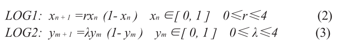

# Completion_code
# 伪随机正交预编码矩阵

上一个章节通过对传统ZCT矩阵进行改进（增加一维混沌映射），从而提高抗截获和安全性能。

而本算法的目的是在提高抗截获性能、安全性能、PAPR抑制性能的同时，降低算法的计算复杂度。而本文的目的是将伪随机正交预编码算法改进为适合硬件电路的算法，在保证原有抗截获性能、隐蔽性能、PAPR抑制性能的同时，进一步降低硬件逻辑资源使用、提高吞吐量。

1. 预编码后的符号序列的AACF（自相关性）主要取决于预编码矩阵行与行（列与列）之间的元素自相关性。
2. 矩阵的特性参数是用于提升传输波形的隐蔽性能，降低矩阵的PAPR。

## **伪随机正交预编码算法修改后思路**

**总体步骤**

1. 根据混沌序列生成三组参数（相位扰乱因子，幅度扰乱因子，循环移位次数控制），对矩阵的相位、幅度、非零元素位置进行控制。
2. 根据三组参数生成对应的正交预编码矩阵。

1. 根据lorenz系统生成混沌序列{x}、{y}、{z}
   + 廖进：采用lorenz系统输出的多个数据，将数据判决（0,1），多个判决结果组合后得到最终随机数
   + lorenz加密算法-西交：将lorenz系统输出的序列处理，将输出序列与自身四舍五入后的数据得到的数作为最终的随机数
2. 根据三个混沌序列生成矩阵的配置参数$\theta_0 、a_1 、a_2 、cyc_1 、cyc_2  $五个配置参数，主要用于相位扰乱、幅度扰乱、非零元素位置扰乱

3. 查看生成酉矩阵与源序列的乘积计算方法

李雅普诺夫指数：https://blog.csdn.net/u013066730/article/details/107656348

# 1. 混沌序列

## 1.1 混沌定义

1. 初值敏感性（）
2. 非线性
3. 混沌吸引子

### 论文：《基于FPGA的超混沌序列发生器-广东工业》

​	原理：Lorenz系统数学模型，采用**Euler**算法进行离散化（式子1到3），时间步长T：0.005s；采用浮点型进行数据表示，64bit位宽。根据xyz序列图，可以得知lorenz混沌序列混乱性不大

+ euler算法提高

 [混沌伪随机序列发生器的FPGA设计与实现_孙克辉.pdf](C:\Users\10252\Desktop\paper\FPGA\混沌\混沌伪随机序列发生器的FPGA设计与实现_孙克辉.pdf) 

此图是混沌序列lorenz生成的xyz序列，横轴是序列标号，竖轴是对应xn（yn、zn）的**绝对值**。

### 论文：《改进型Logistics混沌序列发生器-西安交通工程》

 [改进型Logistic混沌序列发生器的设计与实现_贾亚娟.pdf](C:\Users\10252\Desktop\paper\FPGA\混沌\改进型Logistic混沌序列发生器的设计与实现_贾亚娟.pdf) 

### 论文：《An efficient method to improve the Logistic map: Design and Implementation 》

 [An_efficient_method_to_improve_the_Logistic_map_Design_and_implementation.pdf](C:\Users\10252\Desktop\paper\FPGA\混沌\An_efficient_method_to_improve_the_Logistic_map_Design_and_implementation.pdf) 

中心思想：通过改进一维混沌序列的部分不太混沌部分以增强混沌特性	以及更高的**Lyapunov指数**

修改后的一维混沌序列公式

这是ILM公式，当$\alpha$=s时，变成SLM公式$x_{n+1}=4\alpha x_n(1-x_n)$。当$x_0$越小，$x_n$取值范围越大。

总结：本论文最终变换公式，保证s在更大的范围内实现混沌输出（保证Lyapunov指数大于0）；并且同时保证Lyapunov指数比SLM的值更大。

### 论文：《基于lorenz混沌系统的数字图像加密算法》

 [基于Lorenz混沌系统的数字图像加密算法_王英.pdf](C:\Users\10252\Desktop\paper\FPGA\混沌\基于Lorenz混沌系统的数字图像加密算法_王英.pdf) 

混沌序列的公设：Golomb对伪随机序列提出的公设  

1. 自相关函数接近冲击函数
2. 在序列区间内数列分布均匀（观察平均值）
3. 互相关函数是零（有待商榷）

为了提高lorenz函数的随机性、均匀分布特性，削弱局部的规律性。采用以下方式实现：1.去掉lorenz的x、y、z序列的整数部分统一值域；2.在去掉整数的基础上将小数点再次右移

### 论文：《An Encryption Method Based on Dual-chaos System 》

 [An_Encryption_Method_Based_on_Dual-Chaos_System.pdf](C:\Users\10252\Desktop\paper\FPGA\混沌\An_Encryption_Method_Based_on_Dual-Chaos_System.pdf) 

决定$x_0$输入，式子1的输出作为式子2的$y_0$。

双混沌系统输出的混沌序列比酉混沌系统输出的混沌序列有更好的随机性，增大秘钥空间--加大破译难度。 

### 论文：基于FPGA的真随机数生成器

[Design_and_implementation_of_chaos_based_true_random_number_generator_on_FPGA.pdf](C:\Users\10252\Desktop\paper\FPGA\混沌\Design_and_implementation_of_chaos_based_true_random_number_generator_on_FPGA.pdf) 

# 2. 矩阵乘

# 0 顶层

## 1 混沌序列生成单元

​												$$\huge x_{k+1}=x_{k}(2^{16}-x_k)*2^{-30}     $$        **(1-1)**

**功能介绍**

1. 实现生成随机性参数
2. 生成的随机参数用于扰乱伪随机正交预编码矩阵的星座点排布和提高随机性
3. 本模块主体功能：输入初始值，固定迭代次数，固定有效位参数，固定扩大倍数；
   1. 以$x_{0}$为初值
   2. 根据式子（1-1）运算并放入寄存器；根据设置的扩大倍数，公式缩放会丢失一些精度；
   3. 运算后的值$x_{1}$，再次重复2步骤，同时一个新的寄存器用于存储硬判决后的$x_{1}$
   4. 迭代次数完成，输出用于存储**硬判决**后的$x_{1}$ 

**输入参数**

1. $x_0$初始值（使用标准握手信号）

   + vld：代表初始值是有效的，本信号的拉高是自由控制，拉低是handshake后拉低
   + rdy：拉低条件：收到hanshake；拉高条件：1.初始化，2.完成迭代

2. 迭代次数（param参数=200）

3. 输出有效位数（param参数=16），1bit就是一个$x_n$

**功能实现**

+ 实现公式，根据此公式完成**迭代**次数

逻辑功能

1. 用时序逻辑直接如公式（1-1），**资源**：一个乘法器，一个加法，2个移位
2. 确定公式的有效数据输入区间（保证迭代次数）--功能是完成输入0-199个序列的输入
   + 开始
     + in_shake**有效的下个周期**
   + 结束
     + 完成第（200）个迭代周期处
3. 计算有效工作区间的迭代次数
   + 有效工作区间有效的周期，进行iter_cnt计数
4. 输入和输出的握手
   + 输入握手：rdy：拉低条件：收到hanshake；拉高条件：1.初始化，2.完成数据发送握手
   + 输出握手：vld：拉高条件：完成迭代；拉低条件：out_shake有效
5. 将功能1，每个公式输出xn经过判断后存入chaos_buffer
   + $2^{15}$ 是中位数，大于等于就取1，小于取0：最高位第16位为1，就代表大于等于中位数

## 2 复数生成单元

cordic单元公式如下：

固定P参数，也就同时固定旋转次数，只需要输入角度，就可以输出对应sin和cos

## 3 序列转化参数单元

$$\huge\theta=(vld\_seq*360)>>seq\_len$$

$$\huge\theta_1=(vld\_seq(1:len/2)*360)>>seq\_len/2$$

$$\huge\theta_2=(vld\_seq(1+N/2:N)*360)>>seq\_len/2$$

$$\huge z_1=(vld\_seq(1:N/2)*4096*18)>>seq\_len/2$$

$$\huge z_2=(vld\_seq(1+N/2:N)*4096*18)>>GAIN\_INDEX/2$$

$$\huge N=subcarriers*OFDM\_symbols$$

六个随机数最后作为参数输入到矩阵生成单元中

$\theta$在fpga中不需要右移位，使用放缩法，默认五个参数扩大$2^{seq_len}$

## 4 矩阵生成单元

                                     （3-1)

 

$$\large S[n]=0.5*\{a_0s_0[(n-z_0)\%N]+a_1s_1[(n-z_1)\%N]\}， n\in\{0,1...N-1\}$$				(3-2)

.0 

$$\huge a=[exp(i*\theta_1*\pi/180),exp(i*\theta_2*\pi/180)]$$(3-3)

### .v-稀疏矩阵生成功能设计

---

**A-IO端口**

| 端口名称                          | IN OR OUT | 作用                 | 性质     |
| --------------------------------- | --------- | -------------------- | -------- |
| clk、rst_n                        | 输入      | 全局时钟，低有效复位 |          |
| rand_x、rand_y、 rand_z——【31:0】 | 输入      | lorenz的输出的随机数 | 16位精度 |
| rand_vld、rand_rdy——【0】         | 输入      | 标准握手信号         | 高有效   |
| N_syms_perfram                    | 参数      |                      |          |
|                                   |           |                      |          |
|                                   |           |                      |          |
|                                   |           |                      |          |
|                                   |           |                      |          |
|                                   |           |                      |          |
|                                   |           |                      |          |

---

**B-基本思路**

构造$s_1,s_2$序列，如式子（3-1），序列0-（N-1），向量的第0个和第N/2个是有数值的；数值大小由$\theta$决定的

-----

1. ##### $s_1,s_2$按照式子$exp[j(theta*\pi\div180)]$ 生成-----------（完成）

   a. 首先根据xyz输入，计算出theta，theta1，theta2，z1，z2向量;

   化简：$exp[j(theta*\pi)]$

   $\huge theta=\frac{x}{2^{len}}$

   b. 将五个向量（16位宽*360），将五个角度处理乘90内，cordic模块的输入

   theta信号处理输入cordic模块，shake信号高有效

   + 第一象限y1：输出sin和cos不变
   + 第二象限y2：sin(y2)=sin(180-y2),cos(y2)=-cos(180-y2)
   + 第三象限y3：sin(y3)=-sin(y3-180),cos(y3)=-cso(y3-180)
   + 第四象限y4：sin(y4)=-sin(360-y4),cos(y4)=cos(360-y4)

   

2. ##### 根据式子（3-3）求出$a_0,a_1$

3. 根据a、s参数生成矩阵的行向量

4. ##### 根据式子3-2得出，$S[z_0],S[z_1],S[z_0+N/2],S[z_1+N/2]$这四个点有值，其余均为0；此为第一列向量公式

   + 根据3-2公式得到第一行（k=1）向量公式，$m(0)=S(0),m(n)=S(N-n),n=1,2,3,... N-1$;使用csc format存储稀疏矩阵
   + 第二行三行等等公式，是根据第一行向量公式的向右移位

5. ##### propm_mat矩阵根据第一列向量，一次循环生成循环正交预编码矩阵

---

### 4.1 酉矩阵的性质

酉矩阵的逆矩阵等于共轭转置矩阵$U^*=U^{-1}$，共轭转置矩阵是原矩阵每个元素求共轭后再转置得到。酉矩阵满秩且每两列是正交的

### 4.2 稀疏矩阵储存方式

（1）OSKI：Optimized Sparse Kernel Interface	

​		OSKI是一个常见的稀疏矩阵计算库。

（2）COO Format

​		稀疏矩阵的存储格式：只存储非零数据，包含val，col，row三个数组

（3）CSR Format

（4）CSC Format

​		CSR的进阶版，数组变成val，col，ptr。

（5）BSSR Format

​		将稀疏矩阵分成大小相同的矩阵块；**OSKI希望通过auto-tuning**

## 5 单精度浮点运算单元（乘、加）

阶码：指数的补码

移码：X移=X+阶码

有符号数：8bit为例最高位1：负数，否则为正数，所以得到8位**补码的范围**[-128,+127];正数最高为0，最大127

8位移码的范围：[-127,1]

## 4 扰乱效果

是一维混沌系统的扰乱效果

